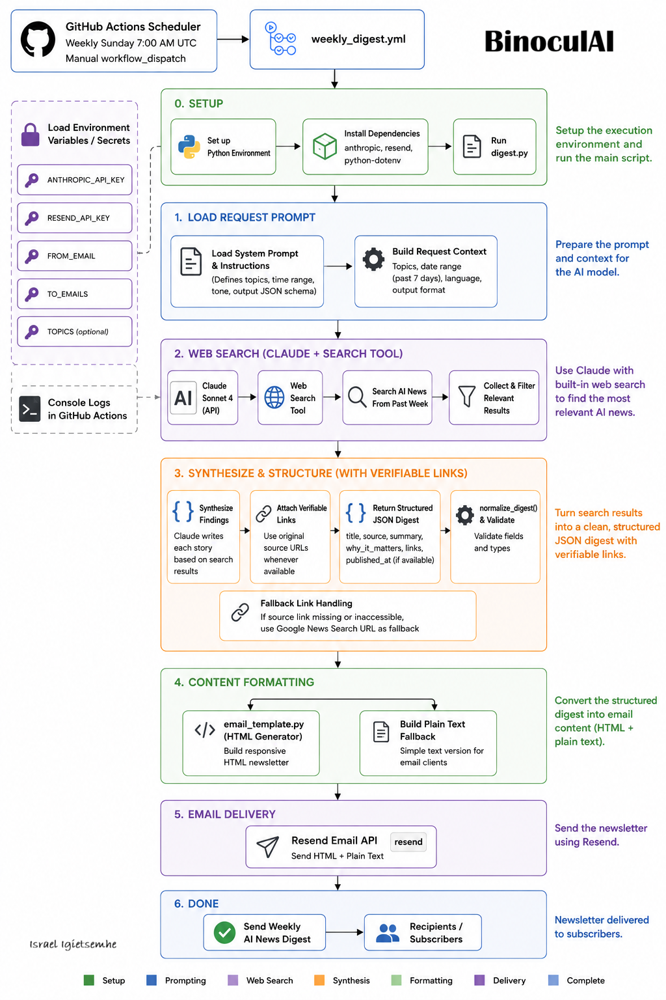

# BinoculAI - Weekly AI News Digest

Fetches the week's top AI headlines via **Claude** (with web search), summarizes them, and delivers a clean HTML email via **Resend** — automatically every Sunday.

If the Claude call fails for any reason (a sunset/retired model, an outage, a rate limit, etc.), the digest automatically falls back to **OpenAI GPT** with its own web search tool, so a single provider hiccup never breaks the weekly run. See `ai_client.py` for the shared fallback logic used by both the AI news and forecasting digests.

## Architecture



## Stack
| Layer | Tool | Version |
|-------|------|---------|
| AI summarizer (primary) | Anthropic Claude Sonnet 5 | `claude-sonnet-5` |
| AI summarizer (fallback) | OpenAI GPT-5.5 | `gpt-5.5` |
| Web search | Claude built-in `web_search` tool / OpenAI built-in `web_search` tool | — |
| Email sender | Resend Python SDK | `2.27.0` |
| Scheduler | GitHub Actions cron | — |

## Setup

### 1. Clone and install
```bash
git clone <your-repo>
cd ai-news-digest
pip install -r requirements.txt
```

### 2. Configure environment
```bash
cp .env.example .env
# Edit .env with your keys
```

You need:
- **Anthropic API key** → [console.anthropic.com](https://console.anthropic.com)
- **OpenAI API key** (fallback) → [platform.openai.com/api-keys](https://platform.openai.com/api-keys)
- **Resend API key** → [resend.com/api-keys](https://resend.com/api-keys)
- **Verified sending domain** in Resend (or use `onboarding@resend.dev` for testing)

`OPENAI_API_KEY` is optional but strongly recommended — without it, a Claude outage or model deprecation will fail the run instead of falling back.

### 3. Run locally
```bash
# Load env vars and run
export $(cat .env | xargs) && python digest.py
```

### 4. Deploy to GitHub Actions

Add these **repository secrets** (`Settings → Secrets → Actions`):
```
ANTHROPIC_API_KEY
OPENAI_API_KEY   ← optional fallback, but recommended
RESEND_API_KEY
FROM_EMAIL
TO_EMAILS        ← comma-separated: you@example.com,other@example.com
```

Add this **repository variable** (optional):
```
TOPICS           ← e.g. LLMs, AI agents, ML research
```

The workflow runs every Sunday at 7:00 AM UTC. You can also trigger it manually from the Actions tab.

## Project structure
```
ai-news-digest/
├── digest.py           # Main script: fetch → summarize → send
├── ai_client.py         # Shared Claude → GPT fallback client (search + structured output)
├── email_template.py   # HTML email builder
├── requirements.txt    # Pinned dependencies
├── .env.example        # Environment variable template
└── .github/
    └── workflows/
        └── weekly_digest.yml  # GitHub Actions cron schedule
```

## Customisation tips
- **Topics**: Change the `TOPICS` env var to focus on any area (e.g. `AI in healthcare, robotics`)
- **Frequency**: Edit the cron expression in `weekly_digest.yml` (e.g. `0 7 * * 1` for Monday)
- **Multiple recipients**: Add comma-separated emails to `TO_EMAILS`
- **Branding**: Edit `email_template.py` to match your colours and footer
- **Models**: Override `ANTHROPIC_MODEL` / `OPENAI_MODEL` env vars to pin different model versions without touching code
